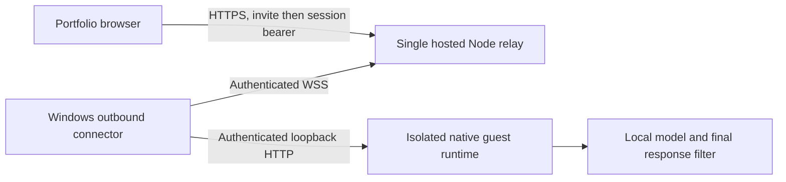

# Optional Revia public text demo transport

For this Portfolio, follow the [Windows setup and Render activation guide](WINDOWS.md).
It includes separate relay/bridge/native templates, one-command local startup,
status checks, and a real deployed-browser smoke test. The exact production CORS
origin is `https://mahousenseii.github.io` (no `/Portfolio/`).

This directory contains the hosted relay, separate outbound Windows connector, and canonical version-1 protocol. The portfolio and native application integrate with them; this is not a deployed service. Public activation stays disabled until the owner configures hosting, credentials, native readiness and the portfolio URL, then verifies the complete deployed path.



No inbound home port, generic tunnel, file IPC, desktop route, cloud AI provider, account system, or browser speech is involved. The website cannot control either computer. Ordinary local HTTP is only between processes on the same PC. Public browser and connector traffic require HTTPS/WSS with certificate validation; Render terminates TLS and can read the traffic. This is not end-to-end encryption.

## Install and tests

Use a supported Node 24 LTS release. The transport was tested with Node 24.15.0 and npm 11.12.1; deployment recipes pin Node 24.21.0, the current LTS patch checked during implementation. The single dependency is `ws` 8.21.3, pinned in `package-lock.json`; Node's built-in HTTP server handles the browser API. WebSocket compression is disabled. Verify supported releases against [Node's release page](https://nodejs.org/en/about/previous-releases) and [the upstream ws release](https://github.com/websockets/ws/releases/tag/8.21.3) when updating.

From the repository root in PowerShell:

```powershell
Set-Location Tools/Presence/WebDemo
npm ci --ignore-scripts
npm test
npm audit --omit=dev
```

`npm test` runs real HTTP/WebSocket relay/connector tests against a recording native-API fixture. `npm run test:native` runs the separate native integration harness; build the repository's `ReviaWebGuestHost` target first. Set `REVIA_WEB_NATIVE_HOST` to its executable path if it is not in the documented default build directory. A passing fixture is not evidence of live inference or public deployment. Repository-level evidence records the full native and portfolio checks.

## Credentials and ownership

Generate independent, cryptographically random credentials of at least 32 bytes in your password manager. Do not paste their values into chat, commit them, print them into logs, or put them in URLs. The relay stores only SHA-256 digests of its host credential and invite code. High entropy is essential because a digest is not password stretching. The connector needs the original host credential; guests receive the original invite code privately. Rotate a compromised invite by replacing its hash and restarting the relay. Rotate a compromised host credential in both places. Native and connector share a different local bearer credential.

| Component | Environment/configuration | Purpose |
|---|---|---|
| Relay | `PORT` (8787 default; Render supplies its port) | Hosted HTTP listener behind TLS ingress |
| Relay | `NODE_ENV=production`, `REVIA_WEB_BIND=0.0.0.0` | Public hosting mode; development requires a literal loopback bind |
| Relay | `REVIA_WEB_HOST_ID` | Exact host ID, 1–64 ASCII letters/digits/underscore/hyphen |
| Relay | `REVIA_WEB_HOST_TOKEN_SHA256` | 64 lowercase hex SHA-256 digest of the host bearer |
| Relay | `REVIA_WEB_INVITE_SHA256` | 64 lowercase hex SHA-256 digest of the invite code; required |
| Relay | `REVIA_WEB_ORIGINS` | Comma-separated exact HTTPS origins, without paths or trailing slashes; at most eight |
| Relay | `REVIA_WEB_TRUSTED_PROXY_CIDRS` | Optional explicitly verified ingress IP/CIDR allowlist; see proxy trust below |
| Relay | `REVIA_WEB_LIMITS` | Optional JSON object overriding documented operating bounds |
| Connector | `REVIA_WEB_RELAY_URL` | Exact `wss://HOST/v1/host`; no credentials, query or fragment |
| Connector | `REVIA_WEB_HOST_ID`, `REVIA_WEB_HOST_TOKEN` | Matching host ID and original host bearer |
| Connector/native | `REVIA_WEB_LOCAL_TOKEN` | Separate local bearer; connector requires printable ASCII, 32–256 bytes |
| Connector | `REVIA_WEB_LOCAL_URL` | Default `http://127.0.0.1:17864`; only a literal loopback HTTP origin is accepted |
| Portfolio | `data/revia-demo.json` | Public relay HTTPS origin and enabled flag only; leave disabled until deployed |

The `.env.relay.example`, `.env.bridge.example`, and `.env.revia.example` templates contain no valid credentials. Keep real local files outside the repository, preferably in `%LOCALAPPDATA%\Revia\WebDemo`, restricted to your account. Local `.env.*` files inside WebDemo are ignored by Git, but the native build copies Tools into build output, another reason to keep secrets outside the source tree. The Windows helper reads `.env.revia` and shares its native token/port with the connector; manual bridge commands must also load that file. Node reads an environment file only when explicitly passed `--env-file`; `npm start` uses the process environment supplied by the hosting platform. No dotenv package is needed.

The checks below validate locally and make **no network connection**:

```powershell
node --env-file=.env.relay relay/main.js --check
node --env-file=.env.revia --env-file=.env.bridge bridge/main.js --check
```

## Windows start, pause, stop and recover

1. Configure the native application's opt-in web guest API with `REVIA_WEB_ENABLED=1` and its separate `REVIA_WEB_LOCAL_TOKEN`, using the repository's web-demo instructions. Start its local model and Revia. The native API must report actual readiness; a connector socket alone never means inference is available.
2. Check connector settings with the command above. Start the connector in a PowerShell terminal:

   ```powershell
   node --env-file=.env.revia --env-file=.env.bridge bridge/main.js
   ```

3. Enable public mode using the authenticated native owner control, then check `GET /v1/status` at the real HTTPS relay. `online` allows admission; `busy` means work is active or the owner has priority. Native control is never forwarded by the connector.
4. **Pause:** keep public mode enabled and set native owner control to paused. The connector remains connected and reports paused readiness. Existing turns cancel and their native contexts end. Guests must start fresh sessions after resuming. The relay retains bounded terminal results for polling until expiry or capacity eviction, but rejects any new work on those old tokens.
5. **Off:** disable public mode through native owner control. Native reports the authoritative `offline` state, causing the connector to cancel work, wait for the original turn to unwind, end tracked contexts, disconnect and stop reconnect attempts. A connector backing off during a relay outage also checks native status before reconnecting. Re-enabling public mode requires starting a fresh connector process. **Application shutdown:** press Ctrl+C in the connector terminal before closing Revia so cleanup is acknowledged while native is available. Unreachable/malformed native status is treated as `unavailable`, not an authoritative owner disable; an abruptly killed native process cannot send an offline status. Native request deadlines and session retention still bound abandoned work after a forced kill.
6. After sleep/network failure, the connector reconnects with capped exponential backoff and jitter, after cleaning old native contexts. It does not resend any old turn. Relay loss revokes all tokens and text immediately; visitors create fresh sessions. If native cleanup is temporarily unavailable, reconnect waits and retries cleanup.

Keep Windows automatic time synchronization enabled and check it after sleep or manual clock changes. Connector/native accept an absolute relay deadline up to five seconds beyond their normal 120-second future bound to tolerate small clock differences, then clamp local native execution to at most 120 seconds. The relay still expires each request after its own original 120-second total lifetime. Earlier deadlines remain authoritative; a PC clock far ahead can expire work immediately, and a relay clock more than five seconds ahead causes dispatch rejection. Tolerance is not a substitute for synchronized clocks.

Start a **local development relay** with `NODE_ENV=development`, `REVIA_WEB_BIND=127.0.0.1`, and an exact loopback browser origin such as `http://127.0.0.1:9000`; use `node --env-file=.env.relay relay/main.js`. Development still requires an invite and both credential hashes. `ws://127.0.0.1:8787/v1/host` is accepted only for a development connector. Never ship a localhost URL in portfolio production assets.

## Concrete Render Web Service recipe

Create one Node Web Service from this repository on `main`. Use root directory **`Tools/Presence/WebDemo`**, build command **`npm ci --omit=dev --ignore-scripts`**, start command **`npm start`**, and health path **`/healthz`**. Set `NODE_VERSION=24.21.0`; use one instance and no autoscaling. The optional [render.yaml](render.yaml) is a reviewable Blueprint recipe with automatic deploys off; creating it still requires the owner's Render account and secret setup. No service has been created by these files.

Configure relay environment values from the table in Render secret/environment storage. Render supplies `PORT`; the application binds it on `0.0.0.0`. Use the exact portfolio origin `https://mahousenseii.github.io`, **without** `/Portfolio/`. Browser CORS origins never contain paths. After deployment, the portfolio's URL is `https://YOUR-SERVICE.onrender.com`; connector URL is `wss://YOUR-SERVICE.onrender.com/v1/host`. These are placeholders, not claimed live endpoints.

Render accepts HTTP and WebSockets on the same public service and handles public TLS. Its health check here establishes only relay process health, not model availability. Confirm behavior against [Render Web Services](https://render.com/docs/web-services), [WebSockets](https://render.com/docs/websocket), [Node version selection](https://render.com/docs/node-version), and [Blueprint schema](https://render.com/docs/blueprint-spec). A rolling replacement loses process-local sessions; users reconnect with fresh sessions. Do not scale to multiple relay instances without a shared coordinator for admission, queues, tokens, epochs and budgets.

The recipe uses the free plan as an unpurchased starting option. Render's documented free tier can sleep after 15 minutes without traffic and take roughly a minute to wake. Active WebSocket messages count as traffic. Instance-hour, bandwidth and build quotas apply; overages or suspension depend on the account. Always-on hosting, bandwidth and the local PC's electricity are not universally free. Consult [current free-service limitations](https://render.com/docs/free); do not assume a cost guarantee from this example.

### Proxy trust and per-source limits

The default ignores all forwarding headers and hashes the actual socket peer with a random process salt. That is safe for a direct listener, but visitors behind hosting ingress share its conservative source budget. For correct per-visitor limits, configure `REVIA_WEB_TRUSTED_PROXY_CIDRS` with **only verified reverse-proxy peers**. Each CIDR is explicitly parsed, `/0` is refused, and at most 16 entries are accepted. When the socket peer matches, the relay validates a bounded `X-Forwarded-For` chain and walks right-to-left through trusted hops, choosing the first untrusted address. Client-supplied leftmost addresses cannot override the trusted boundary. Invalid/oversized chains fall back to the peer bucket. Raw addresses are never logged or stored in the rate map.

[Render's security article](https://render.com/articles/how-render-handles-ddos-attacks) identifies `X-Forwarded-For` as its client-address source. The checked public documentation does **not** establish stable ingress CIDRs or a sanitized-header/hop-count guarantee. Obtain the exact ingress trust contract/ranges from Render for the deployed service and verify source buckets using controlled requests before enabling the portfolio. Never guess a private `/8`, trust every proxy, trust `RENDER=true`, or reuse Render's **outbound** IP ranges: those describe a different direction. Private-network callers must not bypass the verified ingress boundary. Until verified, leave the allowlist empty and treat the shared limit as a known deployment limitation. This requirement is pending owner/provider setup, not a claim that public proxy validation passed.

## Docker alternative on an existing host

From this directory:

```powershell
docker build -t revia-text-relay .
docker run --rm --name revia-text-relay --env-file .env.relay -p 127.0.0.1:8787:8787 revia-text-relay
```

The container runs as the `node` user and contains relay/protocol files only. Put an existing correctly configured HTTPS/WebSocket reverse proxy in front; match `PORT` to the published container port if overriding 8787. The loopback publish example deliberately does not expose unencrypted bearer traffic publicly. Configure only that verified proxy's source address in the trust allowlist. This is an alternative packaging path, not a second required service or a home-router forwarding instruction. Docker image execution must be verified in the owner's Docker environment.

## Bounds, fairness and retention

`relay/config.js` is authoritative for configurable values and hard ceilings. Lower limits through `REVIA_WEB_LIMITS`; invalid keys or out-of-range numbers fail startup. Initial limits are:

| Limit | Default | Allowed ceiling |
|---|---:|---:|
| Live guest sessions | 10 | 10 |
| Idle / total session lifetime | 15 / 30 minutes | 15 / 30 minutes |
| Running web turns / FIFO waiting turns | 1 / 4 | 1 / 4 |
| Submitted text | 2,000 Unicode code points and 8 KiB UTF-8 | Fixed |
| Whole HTTP JSON / WebSocket frame | 16 / 32 KiB | Fixed |
| Final reply text | 16 KiB UTF-8 | Fixed |
| Total request lifetime including queue | 120 seconds | 120 seconds |
| Submissions per session / source per minute | 6 / 30 | 6 / 60 |
| Session issuance per source per minute | 5 | 20 |
| Status / all API requests per source per minute | 120 / 300 | 1,000 / 1,000 |
| Accepted turns per UTC day | 200 | 1,000 |
| Retained requests/idempotency entries per session | 32 | 32 |
| Total retained input and reply bytes | 2 MiB | 8 MiB |
| Rate-key entries (hashed source/session buckets) | 2,048 | 4,096 |
| Host heartbeat loss / cancel acknowledgement timeout | 15 / 5 seconds | 30 / 10 seconds |
| HTTP connections / queued WebSocket output | 128 / 128 KiB | Fixed |

One pending request per session plus FIFO dispatch prevents a guest from filling the queue. Queue rejection and authentication failure never dispatch inference. Native also imposes its independent generation/history limits. HTTP headers are capped at 8 KiB with request/header timeouts. Rate windows expire after one minute; a full map refuses new keys. Idempotency records are never evicted while their session remains usable, so a retry cannot become a second execution; the 33rd distinct turn requires a new session.

The relay keeps text only in process memory. Submitted text is released on terminal completion; filtered replies and content hashes stay until session idle/total expiry, explicit deletion, relay shutdown or host loss. A paused/closed session can be evicted to admit a fresh guest when the session cap is full. A process restart clears all tokens, texts, queues, rate buckets and the process-local daily counter. The daily counter is therefore a per-process UTC-day budget, not a durable account quota. End/expiry is sent to native; the connector deletes native contexts on disconnect. Native independently expires abandoned contexts when transport cleanup is impossible.

Application logs contain only static startup/check messages, not transcripts, tokens, raw IPs, model prompts or diagnostic paths. Render, a reverse proxy, OS/process diagnostics, crash dumps and the operator can have separate visibility/retention. Do not promise zero infrastructure retention or submit sensitive material. No guest text becomes durable owner memory by this transport.

## Troubleshooting and release order

| Observation | Check |
|---|---|
| `/healthz` succeeds but page says offline | Connector running, exact host ID/bearer, WSS URL, outbound connectivity |
| starting/unavailable | Native API token, explicit public enablement, model process and native model-health check |
| paused | Native owner control; resume, then create a fresh browser session |
| busy/queued | Owner priority or another guest; FIFO queue and deadline still apply |
| 401 | Token expired, session closed, host changed epoch, or relay restarted; start fresh |
| 403 admission | Wrong invite; do not add an anonymous bypass |
| 403 browser | Exact origin configuration; `/Portfolio/` is not part of an origin |
| 429 | Session/queue/rate/daily/result capacity reached; inspect configured bounds; verify trusted proxy topology |
| Requests stop after sleep | Connector cleans abandoned native contexts before reconnect; model/native must be responsive |
| Cancel does not free the queue | Native turn has not unwound; after ack timeout the relay drops the host and revokes sessions |
| Configuration check fails | Required hashes, printable independent connector secrets, HTTPS origin, URL/path and bounds |

Release relay and connector/native together first, run transport/native tests and confirm deployed TLS, source limiting, readiness, end/cancel and two guest isolation. Only then publish the portfolio's real relay URL and enable flag. A frontend arriving first remains disabled/unavailable. To roll back, disable the portfolio flag and pause native public mode, stop the connector, then restore a compatible tested relay/connector/native release. Restart revokes old sessions; never preserve or replay queued inference across versions.

Future voice requires a separate design for bounded audio formats, explicit playback, render-only Qwen output, then push-to-talk Whisper input, permission handling and cancellation. This release has no microphone UI or voice promise.
