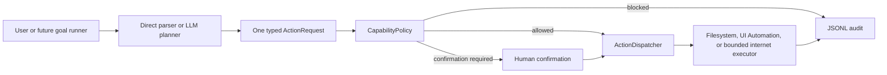
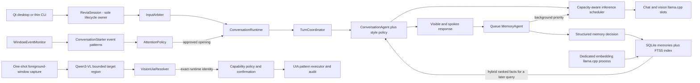

# R.E.V.I.A architecture

## Trust boundary

The language model is a planner, not an operating-system authority. It can propose one typed action. Deterministic C++ code validates the proposal, computes the risk, resolves paths, enforces approved roots, asks for confirmation when required, dispatches only to a registered executor, and audits the outcome.

## Current owners

| Module | Responsibility | Must not own |
| --- | --- | --- |
| `Planning` | Convert direct input or model JSON into one `ActionRequest` | Permission decisions or OS execution |
| `Policy` | Load capability settings, normalize paths, calculate risk and verdict | Prompting the LLM or changing files |
| `Actions` | Define action/result types, coordinate evaluation and dispatch | Action-specific Windows behavior |
| `Filesystem` | Perform the supported file operation using the policy-resolved paths | Expanding scope or bypassing confirmation |
| `Windows` | Resolve vision regions to typed UIA identities, then inspect or interact through control patterns | Coordinate clicking, shell execution, or app-scope decisions |
| `Internet` | Decide when an enabled lookup is useful and query fixed approved HTTPS knowledge endpoints | General sockets, arbitrary URL fetching, or permission changes |
| `Speech` | Own SAPI/Qwen3-TTS output, persistent voice presets and profile assignments, WinMM capture, whisper.cpp transcription, queues, and cancellation | Conversation policy or widget rendering |
| `Vision` | Capture the virtual desktop for analysis or the pinned foreground-window crop for actions, then parse bounded target intents | Acting at coordinates, granting application scope, or retaining captures |
| `Audit` | Append the request, verdict, and result to JSONL | Deciding whether an action is allowed |
| `Runtime` | Own the reusable session lifecycle, cancellation, state, and thread-safe UI events | Rendering widgets or bypassing policy |
| `Resources` | Inventory addressable hardware and derive one immutable cross-pipeline placement/budget plan | Starting workers, executing jobs, or changing capability authority |
| `Desktop` | Render the Qt shell and narrow panels such as `PipelinePanel` | Model logic, memory ownership, or OS permissions |
| `Agents` | Run the interactive conversation, conversation-style policy, input arbitration, and queued background memory tasks | OS permissions or hidden unbounded work |
| `Memory` | Store structured facts and vectors in SQLite, then fuse BM25 and cosine-ranked results | Deciding which raw model text is trustworthy |
| `LLM` | Chat, schedule bounded shared-server slots, and propose structured actions | Terminal/widget output or direct access to the shell/filesystem |
| `Core` | Configuration, routing, logging, bounded context, and the thin CLI shell | A second runtime lifecycle or hidden permission escalation |

New abilities should follow the same shape: a typed request, capability-specific policy fields, a narrow executor, limits/timeouts, audit fields, and tests proving both the allowed path and denial path.

## Current turn path

The visible reply runs first and owns inference priority. Only after a successful reply is ready does the coordinator queue automatic memory evaluation on its worker. A shared-server inference scheduler admits no more requests than llama.cpp reports as slots and always admits waiting interactive work before waiting background memory work. Before services start, `ResourcePlanner` inventories the exact devices exposed by the configured llama.cpp executable and resolves service-specific GPU IDs, CPU thread shares, VRAM reservations, and bounded RAM caches. It keeps chat/vision on the highest-capacity device whenever the model fits and uses llama.cpp layer splitting only when combined GPU capacity is required. If an owned llama.cpp child crashes, its stale process handle is released and the next conversation turn restarts it. The dedicated embedding server is outside the chat scheduler and remains parallel on every machine.

TTS consumes sentence fragments on its own cancellable worker; microphone capture and whisper transcription have a separate lifecycle; perception and initiative keep their own bounded workers; Qt has its own operation workers. These are parallel, observable pipelines, not one sequential prompt chain. The `Pipelines` tab shows their state and effective compute assignment, while the `Resources` tab shows the startup hardware/budget map; neither panel owns a worker. Parallelism does not add authority: every side effect still passes through capability policy and audit.

Qwen3-TTS runs as an authenticated loopback worker because the model runtime is Python/PyTorch, while lifecycle, persistence, requests, fallback, and UI remain C++ owned. VoiceDesign creates one reference WAV from a description. The Base model reuses that reference through a cached clone prompt. Only one speech model stays resident, generated audio remains under `RuntimeData/Voices`, and Windows SAPI is the failure fallback. On unequal GPUs, the resource plan prefers a secondary CUDA device for this independent worker and leaves the primary to chat/vision. It does not model-parallelize one utterance or split a sentence across cards. The worker validates free VRAM and dtype support on its assigned device, then warms in the background after chat is ready.

`ReviaSession` is the interface-neutral lifecycle owner. It starts or attaches to the configured llama.cpp processes, accepts one foreground operation at a time, publishes `RuntimeEvent` values, cancels an active request through `std::stop_token`, drains memory results, and shuts down only child processes it owns. `ConversationRuntime` owns approved conversational turns, their context, generation, grounding, streamed speech, and timing. Foreground serialization protects one coherent conversation/action state; it does not stop the independent workers above. Both Qt and the CLI use this same owner. Qt receives events through a queued UI-thread handoff; the CLI is a thin terminal adapter with a poll worker, not a second implementation of Revia.

Speaking first is event-driven. `ConversationStarter` recognizes a completed focus stretch,
a return to an application, or repeated switching from admitted Tier 0 window events. An
unfinished goal is another concrete signal. Those events wake the initiative worker;
elapsed time can qualify the evidence or debounce a click, but it cannot wake the worker
or create a cue. `AttentionPolicy` still applies confidence, active-input, full-screen,
exclusion, cooldown, dismissal, hourly-budget, and measured-precision gates. Ordinary
conversation openings enter `ConversationRuntime` and the next natural user reply
continues them; action-backed proposals retain explicit accept/dismiss handling.

## Single-purpose construction rule

New behavior is split by reason to change:

- `ConversationStylePolicy` owns repair, variation guidance, and the narrow stock-tail filter; it does not call a model or store memory.
- `ConversationRuntime` owns approved dialogue turns; it does not start servers, grant capabilities, or decide when interruption is welcome.
- `ConversationStarter` recognizes meaningful event patterns; it does not generate text or decide permission to speak.
- `AttentionPolicy` decides whether an observed opportunity may interrupt; timers are limits and never causes.
- `InputArbiter` owns voice-noise, duplicate, and fragment admission; it does not generate replies.
- `InferenceScheduler` owns shared llama slot capacity and priority; it does not build prompts or issue HTTP requests.
- `ResourcePlanner` detects hardware and calculates placement/budgets; it does not start a process or execute queued work.
- `PipelinePanel` renders runtime events; it does not query or control a worker.
- `ResourcePanel` renders the immutable startup plan; it does not monitor hardware directly or mutate settings.
- `CapabilityPanel` renders and requests explicit permission edits; `CapabilityEditor` atomically validates and persists them, and `ActionRuntime` reloads policy immediately.
- `InternetLookupPolicy` makes the deterministic local lookup decision; `InternetSearchExecutor` owns fixed hosts, HTTPS, limits, and sourced parsing. Neither one writes conversational memory.
- `ConversationQualityMonitor` counts groundedness, ownership, stock-tail, and repetition regressions; it reports diagnostics and never rewrites model output.
- `VisionActionParser` accepts only bounded invoke/value intents; it never inspects Windows or executes.
- `VisionUiaResolver` matches geometry and accessible names and returns a typed runtime identity; it never clicks coordinates or grants application scope.
- `WindowsAutomationExecutor` rechecks that exact identity and invokes a UIA pattern; it never falls back to a name or coordinate when a resolved element changed.
- `CapabilityPolicy` owns executable and per-executable control scopes; `DesktopActionRateLimiter` owns rolling mutable-action admission. Neither inspects pixels or invokes UIA.
- Shells own presentation only. `ReviaSession` remains the sole runtime lifecycle owner.

When a feature needs model logic, persistence, OS authority, and presentation, those are four components connected through typed values or events—not four methods added to one window or service.

The embedding server is a separate owned process from the chat server. Memories are embedded with the configured document prefix, user queries with the configured query prefix, and the SQLite store combines semantic and lexical rankings using reciprocal-rank fusion. Missing vectors are backfilled by the background memory agent. Embedding failures degrade to FTS rather than disabling chat.

## Execution modes

- `disabled`: all capability actions are blocked.
- `supervised`: actions at or below `autoApproveRiskThrough` run; higher-risk in-scope actions require an explicit prompt.
- `approved_scope`: actions at or below the ceiling run without a prompt; higher-risk actions are blocked instead of falling back to confirmation.

Desktop scope has two keys: an executable must be present in `approvedApplications`, and
mutable controls must match that executable's `approvedControls` names/automation ids (or
an explicit `"*"`). A shared rolling limiter caps mutable Focus/Value/Invoke admissions.
Rate refusal changes the ordinary policy outcome to blocked before dispatch, so it is
recorded by the same JSONL audit path rather than hidden in a UI-only throttle.

Internet scope is independent and disabled by default. A `WebSearch` request is read-only
but remains blocked unless `internet.enabled` is true. The executor, not the model, chooses
the DuckDuckGo or Wikipedia host and path; configuration pins the exact hosts plus timeout,
response-size, result-count, and rolling request limits. Returned text is labelled untrusted
grounding before entering the conversation prompt. Audit retains query length but not text.

The distinction matters for unattended operation. An autonomous run must not wait forever at a prompt or silently broaden its permissions.

## Non-negotiable invariants

1. Model text never becomes a shell command.
2. Source and destination must both remain within an approved root.
3. Desktop actions must name an executable in the application allowlist and use UI Automation patterns rather than unrestricted input injection.
4. A dry run must not mutate state.
5. Blocked or unconfirmed actions never reach an executor.
6. Unknown configuration values fail closed.
7. Every dispatched or rejected action is auditable.
8. Screen capture is opt-in, local, short-lived, and visibly reported.
9. New capabilities start disabled or supervised and earn unattended access through tests and explicit configuration.
10. Internet grounding never exposes a general browser, socket, or model-selected URL.
