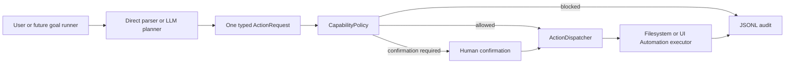
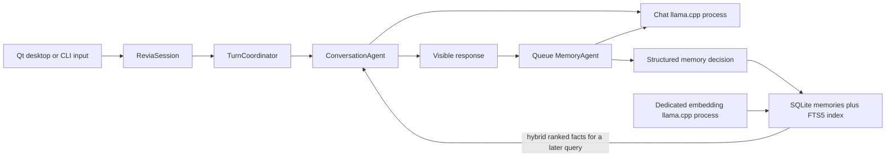

# R.E.V.I.A architecture

## Trust boundary

The language model is a planner, not an operating-system authority. It can propose one typed action. Deterministic C++ code validates the proposal, computes the risk, resolves paths, enforces approved roots, asks for confirmation when required, dispatches only to a registered executor, and audits the outcome.

## Current owners

| Module | Responsibility | Must not own |
| --- | --- | --- |
| `Planning` | Convert direct input or model JSON into one `ActionRequest` | Permission decisions or OS execution |
| `Policy` | Load capability settings, normalize paths, calculate risk and verdict | Prompting the LLM or changing files |
| `Actions` | Define action/result types, coordinate evaluation and dispatch | Action-specific Windows behavior |
| `Filesystem` | Perform the supported file operation using the policy-resolved paths | Expanding scope or bypassing confirmation |
| `Windows` | Inspect or interact with named controls through Microsoft UI Automation | Coordinate clicking, shell execution, or app-scope decisions |
| `Speech` | Own SAPI/Qwen3-TTS output, persistent voice presets and profile assignments, WinMM capture, whisper.cpp transcription, queues, and cancellation | Conversation policy or widget rendering |
| `Vision` | Capture the virtual desktop to a short-lived PNG after consent | Deciding when consent is optional or retaining captures |
| `Audit` | Append the request, verdict, and result to JSONL | Deciding whether an action is allowed |
| `Runtime` | Own the reusable session lifecycle, cancellation, state, and thread-safe UI events | Rendering widgets or bypassing policy |
| `Desktop` | Render tabbed Qt chat, activity, voice-studio, settings, tray, runtime state, and confirmation controls | Model logic, memory ownership, or OS permissions |
| `Agents` | Run the interactive conversation and queued background memory tasks | OS permissions or long-running hidden work |
| `Memory` | Store structured facts and vectors in SQLite, then fuse BM25 and cosine-ranked results | Deciding which raw model text is trustworthy |
| `LLM` | Chat and propose structured actions | Direct access to the shell or filesystem |
| `Core` | Configuration, routing, logging, context, and the CLI fallback | Hidden permission escalation |

New abilities should follow the same shape: a typed request, capability-specific policy fields, a narrow executor, limits/timeouts, audit fields, and tests proving both the allowed path and denial path.

## Current turn path

The visible reply runs first and owns inference priority. Only after a successful reply is ready does the coordinator queue automatic memory evaluation on its worker. TTS consumes the finished response on its own cancellable worker; microphone capture and whisper transcription have a separate lifecycle. This keeps speech and memory work from increasing time-to-first-token. It is asynchronous specialization, not autonomous agency. A future long-running agent must have explicit lifecycle ownership, cancellation, budgets, observable health, and must still route every side effect through the capability policy.

Qwen3-TTS runs as an authenticated loopback worker because the official model runtime is Python/PyTorch, while lifecycle, persistence, requests, fallback, and UI remain C++ owned. VoiceDesign creates one reference WAV from a description. The Base model reuses that reference through a cached clone prompt. Only one speech model stays resident, generated audio remains under `RuntimeData/Voices`, and Windows SAPI is the failure fallback. When a profile has a Qwen voice, the speech model loads before llama.cpp so automatic GPU fitting accounts for both allocations.

`ReviaSession` is the interface-neutral lifecycle owner. It starts or attaches to the configured llama.cpp processes, accepts one operation at a time, publishes `RuntimeEvent` values, cancels an active request through `std::stop_token`, drains memory results, and shuts down only child processes it owns. Qt receives these events through a queued UI-thread handoff; it never calls model, memory, or filesystem implementation code directly.

The embedding server is a separate owned process from the chat server. Memories are embedded with the configured document prefix, user queries with the configured query prefix, and the SQLite store combines semantic and lexical rankings using reciprocal-rank fusion. Missing vectors are backfilled by the background memory agent. Embedding failures degrade to FTS rather than disabling chat.

## Execution modes

- `disabled`: all capability actions are blocked.
- `supervised`: actions at or below `autoApproveRiskThrough` run; higher-risk in-scope actions require an explicit prompt.
- `approved_scope`: actions at or below the ceiling run without a prompt; higher-risk actions are blocked instead of falling back to confirmation.

The distinction matters for unattended operation. An autonomous run must not wait forever at a prompt or silently broaden its permissions.

## Non-negotiable invariants

1. Model text never becomes a shell command.
2. Source and destination must both remain within an approved root.
3. Desktop actions must name an executable in the application allowlist and use UI Automation patterns rather than unrestricted input injection.
4. A dry run must not mutate state.
5. Blocked or unconfirmed actions never reach an executor.
6. Unknown configuration values fail closed.
7. Every dispatched or rejected action is auditable.
8. Screen capture is opt-in, local, short-lived, and visibly reported.
9. New capabilities start disabled or supervised and earn unattended access through tests and explicit configuration.
