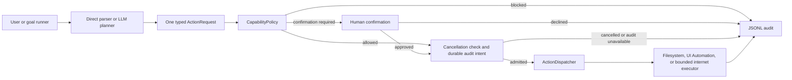
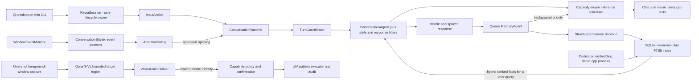

# R.E.V.I.A architecture

## Trust boundary

The language model is a planner, not an operating-system authority. It can propose one typed action. Deterministic C++ code validates the proposal, computes the risk, resolves paths, enforces approved roots, asks for confirmation when required, dispatches only to a registered executor, and audits the outcome.

`ActionRuntime::Execute` and `ExecuteScoped` share this dispatch boundary. A
required intent must be written and flushed before an executor starts; cancellation
is checked again after that write. Result recording is checked independently.
`ActionOutcome::result` always retains the actual executor result, including a
successful mutation whose completion audit failed. Callers use `Succeeded()` to
decide whether dependent work may continue and `Message()` to report both execution
and audit errors. Goals stop without verification or retry on an audit storage error.

Executed actions normally produce two JSONL records joined by `audit_transaction`:
`record_type: intent` and `record_type: result`. Intent records omit `attempted` and
`succeeded`; an intent without a result means the outcome is unknown and is not
permission to retry. Historical records without `record_type` are result records.
No repository component replays actions from this journal. Competing writers and
an incomplete trailing line cause admission to fail; the logger does not truncate
or silently repair an existing audit file.

## Identity persistence

`ReviaSession` owns the save lifecycle; `RelationshipRegistry` continues to own
the single identity snapshot and `IdentityStore` its schema version 2 file. After
a successful identity load, the session saves every 30 seconds. A long foreground
inference does not block that timer. The cadence bounds ordinary unsaved work;
scheduling delays and storage failures can extend it, and failures are logged.

Shutdown first requests cancellation, joins owned workers, acquires the foreground
operation lock, joins the save worker, and consumes final background completions.
Only then does it save the final relationships, preferences, development and mood.
Momentary emotion remains transient. Failed identity loads disable both periodic
and final saves for that session, preserving the unreadable file for recovery.

The store writes a neighboring temporary file, checks write/flush/close, then
replaces the identity. Windows uses `_commit` and `MoveFileExW` with replacement
and write-through flags; POSIX flushes the file with `fsync` before rename. Failed
replacement preserves the previous target. This is not a cross-process identity
merge or a guarantee against hardware/power loss; POSIX directory durability has
not been certified. The existing file format and profile baseline rules are unchanged.

## Local person attribution

ReviaSession owns the current local person selection. A conversational introduction
is resolved through the existing RelationshipRegistry before appraisal and reply
construction; completed evidence uses that captured entity ID. The first named person
adopts anonymous local history, later people remain separate, and returning names
reuse the registry's existing normalized IDs. Ordinary turns and session commands
retain the selection until another introduction or a fresh session.

Adapter conversations keep their platform entity IDs. A stated name can update that
entity's display name, but recording adapter evidence cannot replace the local person.
Relationship history persists; the current local selection does not. A fresh session
starts anonymous and does not guess who is at the keyboard. This is textual attribution,
not biometric recognition or authentication, and it does not grant capabilities.

## Accepted learned findings

`MemoryAgent::SubmitLearnedFinding` commits an already-approved finding through the
existing memoryManager/longTermMemory curation and deduplication path before accepting
optional embedding work. `SavedEmbeddingQueued` therefore means the semantic content
is already stored. Queue pressure returns SavedWithoutEmbedding or AlreadyExists;
storage failure returns Failed without queueing. Unclassified conversation candidates
still use the existing classifier path and are not saved by this admission rule.

The store can return the new or deduplicated row id. The worker uses that id to save
the vector on the same row, preserving the original insertion result in its event.
An optional vector-write error is separate from semantic save success and is published
by the session as an embedding error. Activity artifacts and curiosity status report
saved content consistently. Shutdown may cancel/discard pending vectors, which remain
discoverable by backfill; it no longer needs to drain uncommitted approved content.

No new store or schema is introduced. The C++ disposition formerly named Queued is
now SavedEmbeddingQueued, and the shared activity-artifact formatter no longer takes
a pending-content phrase. Submission now includes the existing database write latency.

The embedding HTTP client checks cancellation during readiness waits in slices of
at most 100 ms, retaining the existing two-second connection and ten-second read
timeouts. This is needed on Windows where a successful socket shutdown did not
wake the blocked read in the owner regression. The request thread still owns and
closes the socket; cancellation does not detach work, retry requests, or require a
responsive inference server. DNS and connection establishment keep their existing
transport limits. This does not certify that an external model stops GPU work.

## Continuing memory indexing

The session enables a backfill subscription when embeddings and the active profile's
memory setting are enabled. Startup readiness failure does not abandon the subscription;
profile activation, active-profile edits and the profile command refresh the same gate.
MemoryAgent runs scans and requests on its existing worker, alongside its weighted
four-turn/two-learning/one-backfill schedule. No additional scheduler or thread owns memory.

Each scan reads at most 25 active rows missing the configured model's vector, using
a row-id cursor so a failing early row cannot hide later rows. Completed batches wait
250 ms before continuing; an exhausted pass resets the cursor and checks again after
30 seconds. This discovers content saved while vector queues were full. Readiness,
model metadata and storage failures are reported and retried with bounded delays of
5, 10, 20, 40 and 60 seconds; a failed batch also retains its ordinary scan delay.
Retries perform new attempts on a later pass, without keeping unbounded queued work.

Queued and in-flight learning/backfill share a model-and-row deduplication set. The
worker rechecks active status and vector presence before inference and saving. Health
checks and embedding requests observe cancellation. Disabling the subscription removes
pending backfill and cancels its request; stopping MemoryAgent joins the worker before
its router can be destroyed. The database schema and stored semantic content are unchanged.

## Observation exclusions

`perception.excludedApplications` and `perception.excludedTitleFragments` exclude
activity metadata only. `PerceptionFilter::Admit` suppresses the matching
`WindowObservation` entirely. Application names match without case sensitivity;
title fragments use a case-insensitive substring match.

These lists do not mask pixels in screenshots sent to vision. Other admitted
events or the idle refresh can still lead to a complete virtual-desktop capture
containing excluded windows. Screen and camera permissions, observation pause,
and public/private context isolation remain separate controls. The Vision panel
and `/perception` status state this boundary explicitly.

## Current owners

| Module | Responsibility | Must not own |
| --- | --- | --- |
| `Planning` | Convert direct input or model JSON into one `ActionRequest` | Permission decisions or OS execution |
| `Policy` | Load capability settings, normalize paths, calculate risk and verdict | Prompting the LLM or changing files |
| `Actions` | Define action/result types, coordinate evaluation and dispatch | Action-specific Windows behavior |
| `Filesystem` | Perform the supported file operation using the policy-resolved paths | Expanding scope or bypassing confirmation |
| `Windows` | Resolve vision regions to typed UIA identities, inspect or interact through control patterns, and synthesize pointer/keyboard input into a verified approved foreground window | Shell execution, app-scope decisions, input to an unverified window, or acting without an emergency stop |
| `Internet` | Decide when an enabled lookup is useful and query fixed approved HTTPS knowledge endpoints | General sockets, arbitrary URL fetching, or permission changes |
| `Speech` | Own SAPI/Qwen3-TTS output, persistent voice presets and profile assignments, WinMM capture, whisper.cpp transcription, queues, and cancellation | Conversation policy or widget rendering |
| `Presence` | Reduce runtime events into an atomic avatar snapshot and validate bounded conversation-only adapter files | Rendering a character, storing platform credentials, inference, or action routing |
| `Vision` | Capture the virtual desktop for analysis, the pinned foreground-window crop for actions, or a single still camera frame, then parse bounded target intents | Acting at coordinates, granting application scope, holding a camera open between frames, or retaining captures |
| `Audit` | Append the request, verdict, and result to JSONL | Deciding whether an action is allowed |
| `Runtime` | Own the reusable session lifecycle, cancellation, state, thread-safe UI events, and the affect state machine both conversation and runtime-confirmed internal events feed | Rendering widgets, bypassing policy, or feeling anything the runtime did not confirm happened |
| `Emotion` | Own the continuous emotion vector, the typed stimulus vocabulary, and slow mood dynamics that feed back into appraisal | Deciding personality, storing relationships, calling a model, or feeling anything the runtime did not confirm |
| `Autonomy` | Own drives, activity lifecycle, and the evidence-gated decision of whether there is any reason to act | Executing activities, granting authority, or letting a timer substitute for evidence |
| `Identity` | Own persistent development (base personality plus learned offsets), per-entity relationships and the evidence that moves them, the canonical state packet handed to every model tier, and atomic schema-versioned persistence | Emotion appraisal, memory retrieval, letting a model assign relationship values, or granting any authority |
| `Resources` | Inventory addressable hardware, derive one immutable cross-pipeline placement/budget plan, and sample live usage against it | Starting workers, executing jobs, changing capability authority, or re-placing a worker because a reading moved |
| `Desktop` | Render the Qt shell and narrow panels such as `PipelinePanel`, `ProfilePanel`, and the read-only `MemoryPanel` and `MindPanel` | Model logic, memory ownership, mutating earned state, or OS permissions |
| `Agents` | Run the interactive conversation, conversation-style policy, input arbitration, and queued background memory tasks | OS permissions or hidden unbounded work |
| `Memory` | Store structured facts and vectors in SQLite, fuse BM25 and cosine-ranked results, and keep the bounded conversation archive | Deciding which raw model text is trustworthy, or storing what the sensitive-content filter refused |
| `Visual` | Sanitize model-produced SVG, store accepted diagrams, recognize drawing requests, and own the local image worker's lifecycle | Rendering, executing anything, or reaching a network beyond its own loopback worker |
| `Content` | Hold the working document and perform block-scoped edits | Calling a model, or offering any mutation that can reach more than one block |
| `Evaluation` | Hold the conversation-contract corpus, score delivered replies against the clause each case defends, and write the report | Producing replies, owning a runtime, or feeding the live quality counters |
| `LLM` | Chat, schedule bounded shared-server slots, and propose structured actions | Terminal/widget output or direct access to the shell/filesystem |
| `Core` | Configuration, routing, logging, bounded context, durable non-authority preferences, crash/exit accounting, and the thin CLI shell | A second runtime lifecycle, or any preference that reaches a capability |

### Store connections are held, not reopened

Both SQLite stores keep one connection per object, opened on first use. This is a
correctness-neutral change with a large cost attached to getting it wrong the other way:
an open here re-runs the entire schema DDL and the legacy-JSONL import check before the
query it was asked for, so reopening per call put that on the critical path of every
conversation turn. Measured on a 200-row store, a trivial `HasMemories()` cost 2.6ms of
which almost none was the query.

Both also set `PRAGMA synchronous=NORMAL`. Under a write-ahead log that still survives a
process crash and risks only the newest commit on power loss, and it removes an fsync from
every write -- which was most of the ten milliseconds an archived turn used to cost, twice
per exchange. Connections are opened `SQLITE_OPEN_FULLMUTEX`, so sharing one across the
prompt path and the background memory worker is serialized by SQLite itself.

Anything that reports a size should ask for a count. `Status()` once loaded every session,
each carrying a correlated `COUNT` and a lookup of its opening line, and then used only
`.size()` -- four hundred subqueries to learn one number.

New abilities should follow the same shape: a typed request, capability-specific policy fields, a narrow executor, limits/timeouts, audit fields, and tests proving both the allowed path and denial path.

## Current turn path

The visible reply runs first and owns inference priority. Only after a successful reply is ready does the coordinator queue automatic memory evaluation on its worker. A shared-server inference scheduler admits no more requests than llama.cpp reports as slots and always admits waiting interactive work before waiting background memory work. Before services start, `ResourcePlanner` inventories the exact devices exposed by the configured llama.cpp executable and resolves service-specific GPU IDs, CPU thread shares, VRAM reservations, and bounded RAM caches. It keeps chat/vision on the highest-capacity device whenever the model fits and uses llama.cpp layer splitting only when combined GPU capacity is required. If an owned llama.cpp child crashes, its stale process handle is released and the next conversation turn restarts it. The dedicated embedding server is outside the chat scheduler and remains parallel on every machine.

TTS consumes complete-sentence jobs on its own cancellable generation pool and explicit ordered playback gate; microphone capture and the persistent loopback whisper service have a separate lifecycle; presence, perception, and initiative keep their own bounded workers; Qt has its own operation workers. These are parallel, observable pipelines, not one sequential prompt chain. The `Pipelines` tab shows their state and effective compute assignment, while the `Resources` tab shows the startup hardware/budget map; neither panel owns a worker. Parallelism does not add authority: every side effect still passes through capability policy and audit.

Qwen3-TTS runs as authenticated loopback workers because the model runtime is Python/PyTorch, while lifecycle, persistence, scheduling, fallback, and UI remain C++ owned. VoiceDesign creates one reference WAV as an atomic primary-worker job. Base-model workers reuse that reference through cached clone prompts. Each selected device owns one complete resident model; complete-sentence jobs may finish out of order, but `OrderedSpeechQueue` releases them strictly by sequence and `SpeechService` bounds look-ahead by job count and bytes. Background visual analysis yields to real user input but may refresh while already-generated voice plays, preventing long speech queues from freezing screen context. Windows SAPI is the failure fallback. This is data-parallel sentence generation, not model parallelism inside one utterance.

Whisper uses a separate owned `whisper-server` child bound only to loopback. It starts with the session so its model is normally warm before the first utterance; a request that cannot reach it falls back to the existing CLI transcription path. Hands-free VAD records complete voiced segments locally and automatic transcripts enter `InputArbiter`, never a privileged command shortcut. Cancelling transcription stops the owned server request promptly, and the next utterance may restart it.

`PresenceRuntime` is a reducer and boundary, not a renderer. It consumes typed runtime events, atomically publishes `RuntimeData/Presence/avatar_state.json`, and appends bounded ordered animation transitions. A separate VRM/Live2D process may smooth and render that state and may crash or close without affecting Revia. Local adapter inboxes accept only allowlisted, bounded conversation events and reject replayed IDs. `ReviaSession` sends public turns through an isolated conversation path with channel-only history and the correct stable viewer relationship, while durable memory, private screen/camera context, and automatic lookup are disabled. Stream speech remains a separate explicit setting, and adapters never enter command, goal, or action routing.

`ReviaSession` is the interface-neutral lifecycle owner. It starts or attaches to the configured llama.cpp processes, accepts one foreground operation at a time, publishes `RuntimeEvent` values, cancels an active request through `std::stop_token`, drains memory results, and shuts down only child processes it owns. `ConversationRuntime` owns approved conversational turns, their context, generation, grounding, streamed speech, and timing. Foreground serialization protects one coherent conversation/action state; it does not stop the independent workers above. Both Qt and the CLI use this same owner. Qt receives events through a queued UI-thread handoff; the CLI is a thin terminal adapter with a poll worker, not a second implementation of Revia.

Speaking first is event-driven. `ConversationStarter` recognizes a completed focus stretch,
a return to an application, or repeated switching from admitted Tier 0 window events. An
unfinished goal is another concrete signal. Those events wake the initiative worker;
elapsed time can qualify the evidence or debounce a click, but it cannot wake the worker
or create a cue. `AttentionPolicy` still applies confidence, active-input, full-screen,
exclusion, cooldown, dismissal, hourly-budget, and measured-precision gates. Ordinary
conversation openings enter `ConversationRuntime` and the next natural user reply
continues them; action-backed proposals retain explicit accept/dismiss handling.

## Single-purpose construction rule

New behavior is split by reason to change:

- `ConversationStylePolicy` owns grounding repair, variation guidance, and the narrow stock-tail filter; it does not call a model or store memory.
- `ResponseFilter` owns the always-on deterministic output boundary and parses the optional AI review verdict; it does not enforce pleasantness or remove ordinary anger, dislike, teasing, mild insults, sulking, or playful condescension. It does not own inference, settings, speech, memory, or conversation history. `ConversationAgent` orders style repair, hard filtering, AI review, and the final hard pass before returning a deliverable reply.
- `ConversationRuntime` owns approved dialogue turns; it does not start servers, grant capabilities, or decide when interruption is welcome.
- `ConversationStarter` recognizes meaningful event patterns; it does not generate text or decide permission to speak.
- `AttentionPolicy` decides whether an observed opportunity may interrupt; timers are limits and never causes.
- `InputArbiter` owns voice-noise, duplicate, and fragment admission; it does not generate replies.
- `EmotionRuntime` owns momentary emotion and slow mood. Its projection supplies speech, reflex, curiosity and presentation; `AffectController` remains a comparison evaluator and cannot overwrite that state. Neither infers the user's emotion or grants authority.
- `MemoryAgent` evaluates the completed user/assistant exchange after delivery. It may persist grounded Revia self-opinions as distinct categories, and it can embed/store one preclassified sourced research finding without reinterpreting raw page text; it never turns an opinion into a factual claim or stores passing affect, jokes, screenshots, page bodies, or private reasoning.
- `InferenceScheduler` owns shared llama slot capacity and priority; it does not build prompts or issue HTTP requests.
- `ResourcePlanner` detects hardware and calculates placement/budgets; it does not start a process or execute queued work.
- `PipelinePanel` renders runtime events; it does not query or control a worker.
- `ResourcePanel` renders the immutable startup plan; it does not monitor hardware directly or mutate settings.
- `CapabilityPanel` renders and requests explicit permission edits; `CapabilityEditor` atomically validates and persists them, and `ActionRuntime` reloads policy immediately.
- `InternetLookupPolicy` makes the deterministic local lookup decision; `InternetSearchExecutor` owns bounded HTTPS lookup and chooses either fixed API sources or the dedicated visible-browser worker. The model supplies a plain query, never a URL, selector, script, or browser command.
- `InternetActivityPanel` renders typed lookup events and the bounded grounding preview; it does not issue requests, change internet permission, or own durable logs.
- `CuriosityAgent` can only nominate `silence`, `speak`, or `research` from bounded conversation, affect, and filtered multi-monitor activity data. `ReviaSession` owns cancellation and deterministic gates; `CuriosityJournal` stores only bounded topic metadata for cross-restart deduplication.
- `ConversationQualityMonitor` counts groundedness, ownership, stock-tail, and repetition regressions; it reports diagnostics and never rewrites model output.
- `VisionActionParser` accepts only bounded invoke/value intents; it never inspects Windows or executes.
- `VisionUiaResolver` matches geometry and accessible names and returns a typed runtime identity; it never clicks coordinates or grants application scope.
- `WindowsAutomationExecutor` rechecks that exact identity and invokes a UIA pattern; it never falls back to a name or coordinate when a resolved element changed.
- `UiaElementLocator` is the single owner of "which window and which element does this typed request mean". Both the UI Automation executor and the desktop-control executor use it, so the re-verification check exists once.
- `DesktopControlExecutor` synthesizes pointer and keyboard input and starts approved applications. It refuses unless the foreground window still belongs to the approved application, confines every point to that window, re-finds a vision-resolved element and clicks its current bounds rather than the planned coordinate, and refuses entirely without a `DesktopInputGuard`.
- `DesktopInputGuard` is the emergency stop. It latches, is reachable without the action mutex or a model turn, and is additionally tripped by the physical ctrl+alt+shift hold sampled immediately before injection.
- `CapabilityPolicy` owns executable and per-executable control scopes, the desktop-control switches, and key-chord admission; `DesktopActionRateLimiter` owns rolling mutable-action admission, budgeting UI Automation and synthesized input separately. None of them inspect pixels or invoke UIA.
- Shells own presentation only. `ReviaSession` remains the sole runtime lifecycle owner.

When a feature needs model logic, persistence, OS authority, and presentation, those are four components connected through typed values or events—not four methods added to one window or service.

The embedding server is a separate owned process from the chat server. Memories are embedded with the configured document prefix, user queries with the configured query prefix, and the SQLite store combines semantic and lexical rankings using reciprocal-rank fusion. Missing vectors are backfilled by the background memory agent. Embedding failures degrade to FTS rather than disabling chat.

## Execution modes

- `disabled`: all capability actions are blocked.
- `supervised`: actions at or below `autoApproveRiskThrough` run; higher-risk in-scope actions require an explicit prompt.
- `approved_scope`: actions at or below the ceiling run without a prompt; higher-risk actions are blocked instead of falling back to confirmation.

Desktop scope has two keys: an executable must be present in `approvedApplications`, and
mutable controls must match that executable's `approvedControls` names/automation ids (or
an explicit `"*"`). A shared rolling limiter caps mutable Focus/Value/Invoke admissions.
Rate refusal changes the ordinary policy outcome to blocked before dispatch, so it is
recorded by the same JSONL audit path rather than hidden in a UI-only throttle.

Internet scope is independent and disabled by default. A `WebSearch` request is read-only
but remains blocked unless `internet.enabled` is true. In API mode the executor chooses the
fixed DuckDuckGo or Wikipedia host and path. In visible mode it owns a dedicated Edge or
Chrome profile and follows bounded public-HTTPS search results while the user can watch.
The model supplies only a plain query; network policy rejects private/local targets,
non-GET/HEAD traffic, downloads, dialogs, and other stateful browser behavior. Autonomous
research additionally requires its own explicit permission. Returned page text is labelled
untrusted grounding before entering the conversation prompt, and typed runtime events expose
the query, visited URLs, timing, failures, and bounded grounding preview.

The distinction matters for unattended operation. An autonomous run must not wait forever at a prompt or silently broaden its permissions.

## Idle background resource admission

GPU memory occupancy and GPU engine activity have different meanings. Resident model
weights and caches can keep a card at 91–94% memory use between requests. `AssessLoad`
keeps that physical pressure visible, but admits background work when the pressure is
only GPU VRAM, at least 512 MiB remains on each pressured card, and their measured
engine activity is at most 55%. This also applies above the 95% display threshold:
on a 12 GiB card, 95.2% occupancy still leaves working room for resident inference.
A busy measured GPU, insufficient absolute headroom, or simultaneous CPU/RAM
pressure still defers optional work. An unreadable engine does not qualify a
pressured GPU for the idle exception.
Voice prefetch stays conservative under memory pressure; admission does not move
models or change device budgets.

The session stabilizes both pressure labels and work admission across three resource
samples. Recovery wakes initiative to reconsider existing evidence and wakes deferred
curiosity. Curiosity also retains its scheduled review and rechecks load after waiting
for the user's quiet window. A wakeup does not grant permission or require speech:
normal attention, capability, cancellation, and rate limits still apply, and a valid
decision to remain silent is different from a worker that never ran.

Curiosity uses the resident Main model for a bounded, interruptible nomination,
with Fast available as a fallback when Main is unavailable. The request constrains
action, field types, and lengths using JSON schema. A verbose rationale is bounded
without changing the selected topic or query; empty/malformed active nominations
still cannot proceed. Decisions are logged so a successful evaluation can be
distinguished from a wakeup followed by a parsing failure.

Ambient vision also uses a bounded JSON schema, with one compact summary string.
The parser additionally accepts textual bullet arrays returned by older requests,
while keeping attention/confidence/issue validation strict. Ambient requests hold
background inference leases and yield to direct requests. A partial assessment is
shown as partial, rather than a successful observation containing error keywords.
Model HTTP reads use the same cancellable transport as embeddings: short socket
wait slices observe cancellation without shortening the overall request timeout.
This matters on Windows, where socket shutdown alone may leave another thread's
`select()` waiting for response bytes and delay the foreground inference lease.
The activity panel uses structured status severity for vision, curiosity, and load,
and coalesces identical component issues for a minute. Resource admission changes
are normal status logs; actual inference/allocation failures remain errors.

`loadAndNameTests.cpp` covers idle residency, active compute, missing measurements,
small-card headroom, multiple GPUs, and CPU/RAM pressure. The session fixture in
`emotionOwnershipTests.cpp` supplies sustained GPU readings through the real sampling
callback, checks hysteresis and deferral, then verifies both recovered and scheduled
idle reviews reach a local test backend without a new user or desktop event.

## Proactive conversation state

Idle nominations also include `think`, `observe`, `create`, and `computer`. These
enter the shared autonomous activity owner instead of the conversation runtime.
The owner enforces one active execution, a two-minute interval and six activities
per rolling hour, with input cancellation and resource checks at admission. Old
activity timestamps cease counting even if no new activity has run to prune them.
Completed private work relieves boredom and its motivating drive.

The nomination context includes elapsed conversation quiet, boredom/social drives,
unanswered openings, recent activities and the current approved PC scope. After an
unanswered opening, further speech gets a longer quiet window; private work remains
available. Normal initiative attention and speech budgets still govern interruptions.

Private creation uses a bounded background request to produce an actual draft,
not the self-inquiry endpoint, which intentionally does not draft replies. Notes
stay under `RuntimeData/Workspace/Notes`, with an activity ID preserved in the
bounded filename. They appear in the activity feed and Mind activity state without
becoming assistant dialogue. PC nominations contain one typed action. Inspection,
approved file reads, directory creation, copying and window focus go through the
ordinary capability policy and audited dispatch; unattended work cannot grant itself
confirmation, delete or move user work, post messages, or invoke arbitrary controls.
PC changes wait while the user is busy. Inspection content stays in the local trace.

State maintenance advances idle drives once per interval, rather than once per
desktop event. A long quiet interval may produce boredom or loneliness through the
canonical emotion owner; recent or ongoing work suppresses that event. Sociability,
independence and mood influence its intensity. Actual incoming conversation relieves
the quiet feeling. This observation is not attributed to user hostility or recorded
as damage to the relationship.

Approved initiative and curiosity openings enter `ConversationRuntime::StartConversation`
and `StartCuriosityConversation`. Their generation path uses the same `BuildTurnPosture`
as private replies and evaluation: earned development, emotion/mood, current-person
relationship, preferences, runtime facts, answer obligation and bounded compressed
history. The existing profile prompt remains the base identity. Proactive event or
research instructions are appended to this state, followed by existing cached screen
context and supplied research grounding. No second personality renderer is involved.
The final transient task names the actual cue or topic; it is never a placeholder
about a private thought that the model could mistake for dialogue. Research asks
for a factual finding with a supplied source URL. Curiosity saves learned research
only when the generated finding itself cites a supplied source, and records when
research produced no saved finding instead of treating arbitrary dialogue as learning.

This does not admit new autonomous work. Session attention/permission/cancellation
gates remain responsible for whether an opening runs. A proactive cue stays transient;
only a successful visible reply enters dialogue. These paths do not automatically
classify the cue into memory, appraise it as user speech, request a fresh screen capture,
recall the archive, run self-inquiry or start an automatic lookup. Public replies retain
their separate audience policy and supplied channel relationship/history.

Public generation also carries `PrivateMemoryAccess::Denied` through the coordinator,
conversation agent, router, selected LLM service and request builder. It suppresses
private query embedding, curated-memory retrieval and classification, including after
a tier fallback. A temporary memory-disabled profile copy at the conversation layer
is insufficient: the LLM client retains the active profile for request construction.
The request restriction never changes that profile or disables later private turns.

## Emotion state and settling

`EmotionRuntime::Current` returns one synchronized emotion/mood/projection snapshot.
`ConversationRuntime` constructs the canonical packet from that state, including when
it is calm. It never revives a separate legacy snapshot as a formatting fallback.
Speech, reflex and curiosity use the same owner's `AffectSnapshot` projection; Presence
and the desktop listen to the session's canonical publication. Public adapter completion
does not appraise its already completed conversation a second time.

Conversation input, failed replies, camera results and terminal
goal results enter typed appraisal. Successful reply delivery still notifies conversation
observers but does not supply achievement reward or a new feeling; usefulness requires
separate evidence. Generic command completion does not appraise help/status text or
duplicate an outcome already observed by its owner. Cancelled goals are not failures. The legacy evaluator
is retained for comparison; its independently evolving social metrics do not describe
active state in the prompt. Development, preferences and person-specific relationships
keep their own established owners. A question naming an emotion asks about existing state;
it does not itself assign that emotion.

The session's state maintenance worker owns timing independently of UI polling, model
availability and the curiosity switch. Emotion takes one existing decay/integration
step per minute. RelationshipRegistry uses in-memory per-person clocks and applies one
bounded friction-cooling step after five quiet minutes; familiarity, affinity and trust
are preserved. Loaded relationships begin a fresh quiet interval. No offline time is
invented or new clock field persisted. A stalled worker takes one step when it resumes.

After twenty minutes without incoming conversation, the emotion owner admits one
typed quiet-conversation stimulus. Admission and incoming-message clock reset share
the appraisal lock. This describes the absence of conversation, not the user's physical
presence or feelings; it grants no permission to speak or act. Rule evaluator `rule-v2`
adds this explicit input. Further ticks settle it rather than repeatedly adding it.

The same worker retains the independent30-second identity save cadence. Failed identity
loads still disable all identity writes, while transient state may settle. Shutdown joins
maintenance before the final quiescent identity snapshot. Saved mood survives restart;
momentary emotion and quiet-interval metadata do not. These behavior changes require
controlled production traces and live personality review in addition to build/tests.

## Profile activation

`ReviaSession` owns profile application. UI activation and `/profile` use the same
locked selection operation: load and validate the file, save the startup selection,
then apply the profile to the generation router, personality baseline, declared
preferences, assigned speech preset and memory backfill subscription. A failed
selection write leaves the running profile unchanged. The command parser cannot
mutate settings or profiles. UI activation is refused during a running operation;
the CLI already holds the session operation lock.

Startup and saves of the active profile share that application helper. Startup first
loads earned identity, then applies the profile baseline while retaining learned
deltas and held preferences. Transport configuration and resource placement remain
startup responsibilities; switching a profile does not reload models or replan GPU
placement. Assigned voices use profile file stems, even if an authored JSON `id`
differs. Existing queued speech retains its captured preset; subsequent speech uses
the new selection. Voice model preparation retains its existing resource plan.

`/set activeProfile` remains a next-start preference, as its description states. It
does not partially change the live profile ID; use `/profile` for live activation.
Editing an inactive profile only saves its file. Active edits preserve authored
personality fields, apply answer obligation and generation overrides to the next
reply, and refresh the memory gate. Profiles never change person attribution or
capability authority.

## Non-negotiable invariants

1. Model text never becomes a shell command.
2. Source and destination must both remain within an approved root.
3. Desktop actions must name an executable in the application allowlist. UI Automation patterns are preferred; synthesized pointer and keyboard input is a separate opt-in capability that is confined to a verified foreground window of that executable, cannot use the Windows key or an application-switching chord, and cannot aim outside that window.
4. A dry run must not mutate state.
5. Blocked or unconfirmed actions never reach an executor.
6. Unknown configuration values fail closed.
7. Every dispatched or rejected action is auditable.
8. Screen capture is opt-in, local, short-lived, and visibly reported.
9. New capabilities start disabled or supervised and earn unattended access through tests and explicit configuration.
10. Internet grounding never exposes a general socket, raw browser API, selector, script, or model-selected URL; the visible worker accepts only a bounded query and enforces public read-only navigation.
11. Desktop operation has a deterministic stop that does not depend on model inference, and an executor without one refuses to act.
