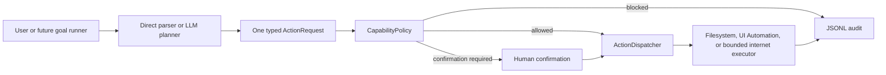
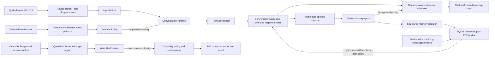

# R.E.V.I.A architecture

## Trust boundary

The language model is a planner, not an operating-system authority. It can propose one typed action. Deterministic C++ code validates the proposal, computes the risk, resolves paths, enforces approved roots, asks for confirmation when required, dispatches only to a registered executor, and audits the outcome.

## Current owners

| Module | Responsibility | Must not own |
| --- | --- | --- |
| `Planning` | Convert direct input or model JSON into one `ActionRequest` | Permission decisions or OS execution |
| `Policy` | Load capability settings, normalize paths, calculate risk and verdict | Prompting the LLM or changing files |
| `Actions` | Define action/result types, coordinate evaluation and dispatch | Action-specific Windows behavior |
| `Filesystem` | Perform the supported file operation using the policy-resolved paths | Expanding scope or bypassing confirmation |
| `Windows` | Resolve vision regions to typed UIA identities, then inspect or interact through control patterns | Coordinate clicking, shell execution, or app-scope decisions |
| `Internet` | Decide when an enabled lookup is useful and query fixed approved HTTPS knowledge endpoints | General sockets, arbitrary URL fetching, or permission changes |
| `Speech` | Own SAPI/Qwen3-TTS output, persistent voice presets and profile assignments, WinMM capture, whisper.cpp transcription, queues, and cancellation | Conversation policy or widget rendering |
| `Presence` | Reduce runtime events into an atomic avatar snapshot and validate bounded conversation-only adapter files | Rendering a character, storing platform credentials, inference, or action routing |
| `Vision` | Capture the virtual desktop for analysis, the pinned foreground-window crop for actions, or a single still camera frame, then parse bounded target intents | Acting at coordinates, granting application scope, holding a camera open between frames, or retaining captures |
| `Audit` | Append the request, verdict, and result to JSONL | Deciding whether an action is allowed |
| `Runtime` | Own the reusable session lifecycle, cancellation, state, thread-safe UI events, and the affect state machine both conversation and runtime-confirmed internal events feed | Rendering widgets, bypassing policy, or feeling anything the runtime did not confirm happened |
| `Emotion` | Own the continuous emotion vector, the typed stimulus vocabulary, and slow mood dynamics that feed back into appraisal | Deciding personality, storing relationships, calling a model, or feeling anything the runtime did not confirm |
| `Autonomy` | Own drives, activity lifecycle, and the evidence-gated decision of whether there is any reason to act | Executing activities, granting authority, or letting a timer substitute for evidence |
| `Identity` | Own persistent development (base personality plus learned offsets), per-entity relationships and the evidence that moves them, the canonical state packet handed to every model tier, and atomic schema-versioned persistence | Emotion appraisal, memory retrieval, letting a model assign relationship values, or granting any authority |
| `Resources` | Inventory addressable hardware, derive one immutable cross-pipeline placement/budget plan, and sample live usage against it | Starting workers, executing jobs, changing capability authority, or re-placing a worker because a reading moved |
| `Desktop` | Render the Qt shell and narrow panels such as `PipelinePanel`, `ProfilePanel`, and the read-only `MemoryPanel` and `MindPanel` | Model logic, memory ownership, mutating earned state, or OS permissions |
| `Agents` | Run the interactive conversation, conversation-style policy, input arbitration, and queued background memory tasks | OS permissions or hidden unbounded work |
| `Memory` | Store structured facts and vectors in SQLite, fuse BM25 and cosine-ranked results, and keep the bounded conversation archive | Deciding which raw model text is trustworthy, or storing what the sensitive-content filter refused |
| `Visual` | Sanitize model-produced SVG, store accepted diagrams, recognize drawing requests, and own the local image worker's lifecycle | Rendering, executing anything, or reaching a network beyond its own loopback worker |
| `Content` | Hold the working document and perform block-scoped edits | Calling a model, or offering any mutation that can reach more than one block |
| `Evaluation` | Hold the conversation-contract corpus, score delivered replies against the clause each case defends, and write the report | Producing replies, owning a runtime, or feeding the live quality counters |
| `LLM` | Chat, schedule bounded shared-server slots, and propose structured actions | Terminal/widget output or direct access to the shell/filesystem |
| `Core` | Configuration, routing, logging, bounded context, durable non-authority preferences, crash/exit accounting, and the thin CLI shell | A second runtime lifecycle, or any preference that reaches a capability |

### Store connections are held, not reopened

Both SQLite stores keep one connection per object, opened on first use. This is a
correctness-neutral change with a large cost attached to getting it wrong the other way:
an open here re-runs the entire schema DDL and the legacy-JSONL import check before the
query it was asked for, so reopening per call put that on the critical path of every
conversation turn. Measured on a 200-row store, a trivial `HasMemories()` cost 2.6ms of
which almost none was the query.

Both also set `PRAGMA synchronous=NORMAL`. Under a write-ahead log that still survives a
process crash and risks only the newest commit on power loss, and it removes an fsync from
every write -- which was most of the ten milliseconds an archived turn used to cost, twice
per exchange. Connections are opened `SQLITE_OPEN_FULLMUTEX`, so sharing one across the
prompt path and the background memory worker is serialized by SQLite itself.

Anything that reports a size should ask for a count. `Status()` once loaded every session,
each carrying a correlated `COUNT` and a lookup of its opening line, and then used only
`.size()` -- four hundred subqueries to learn one number.

New abilities should follow the same shape: a typed request, capability-specific policy fields, a narrow executor, limits/timeouts, audit fields, and tests proving both the allowed path and denial path.

## Current turn path

The visible reply runs first and owns inference priority. Only after a successful reply is ready does the coordinator queue automatic memory evaluation on its worker. A shared-server inference scheduler admits no more requests than llama.cpp reports as slots and always admits waiting interactive work before waiting background memory work. Before services start, `ResourcePlanner` inventories the exact devices exposed by the configured llama.cpp executable and resolves service-specific GPU IDs, CPU thread shares, VRAM reservations, and bounded RAM caches. It keeps chat/vision on the highest-capacity device whenever the model fits and uses llama.cpp layer splitting only when combined GPU capacity is required. If an owned llama.cpp child crashes, its stale process handle is released and the next conversation turn restarts it. The dedicated embedding server is outside the chat scheduler and remains parallel on every machine.

TTS consumes complete-sentence jobs on its own cancellable generation pool and explicit ordered playback gate; microphone capture and the persistent loopback whisper service have a separate lifecycle; presence, perception, and initiative keep their own bounded workers; Qt has its own operation workers. These are parallel, observable pipelines, not one sequential prompt chain. The `Pipelines` tab shows their state and effective compute assignment, while the `Resources` tab shows the startup hardware/budget map; neither panel owns a worker. Parallelism does not add authority: every side effect still passes through capability policy and audit.

Qwen3-TTS runs as authenticated loopback workers because the model runtime is Python/PyTorch, while lifecycle, persistence, scheduling, fallback, and UI remain C++ owned. VoiceDesign creates one reference WAV as an atomic primary-worker job. Base-model workers reuse that reference through cached clone prompts. Each selected device owns one complete resident model; complete-sentence jobs may finish out of order, but `OrderedSpeechQueue` releases them strictly by sequence and `SpeechService` bounds look-ahead by job count and bytes. Background visual analysis yields to real user input but may refresh while already-generated voice plays, preventing long speech queues from freezing screen context. Windows SAPI is the failure fallback. This is data-parallel sentence generation, not model parallelism inside one utterance.

Whisper uses a separate owned `whisper-server` child bound only to loopback. It starts with the session so its model is normally warm before the first utterance; a request that cannot reach it falls back to the existing CLI transcription path. Hands-free VAD records complete voiced segments locally and automatic transcripts enter `InputArbiter`, never a privileged command shortcut. Cancelling transcription stops the owned server request promptly, and the next utterance may restart it.

`PresenceRuntime` is a reducer and boundary, not a renderer. It consumes typed runtime events, atomically publishes `RuntimeData/Presence/avatar_state.json`, and appends ordered animation transitions. A separate VRM process may smooth and render that state and may crash or close without affecting Revia. Local adapter inboxes accept only allowlisted, bounded conversation events; `ReviaSession` sends them directly to the conversation runtime with speaking disabled and never through command, goal, or action routing.

`ReviaSession` is the interface-neutral lifecycle owner. It starts or attaches to the configured llama.cpp processes, accepts one foreground operation at a time, publishes `RuntimeEvent` values, cancels an active request through `std::stop_token`, drains memory results, and shuts down only child processes it owns. `ConversationRuntime` owns approved conversational turns, their context, generation, grounding, streamed speech, and timing. Foreground serialization protects one coherent conversation/action state; it does not stop the independent workers above. Both Qt and the CLI use this same owner. Qt receives events through a queued UI-thread handoff; the CLI is a thin terminal adapter with a poll worker, not a second implementation of Revia.

Speaking first is event-driven. `ConversationStarter` recognizes a completed focus stretch,
a return to an application, or repeated switching from admitted Tier 0 window events. An
unfinished goal is another concrete signal. Those events wake the initiative worker;
elapsed time can qualify the evidence or debounce a click, but it cannot wake the worker
or create a cue. `AttentionPolicy` still applies confidence, active-input, full-screen,
exclusion, cooldown, dismissal, hourly-budget, and measured-precision gates. Ordinary
conversation openings enter `ConversationRuntime` and the next natural user reply
continues them; action-backed proposals retain explicit accept/dismiss handling.

## Single-purpose construction rule

New behavior is split by reason to change:

- `ConversationStylePolicy` owns grounding repair, variation guidance, and the narrow stock-tail filter; it does not call a model or store memory.
- `ResponseFilter` owns the always-on deterministic output boundary and parses the optional AI review verdict; it does not enforce pleasantness or remove ordinary anger, dislike, teasing, mild insults, sulking, or playful condescension. It does not own inference, settings, speech, memory, or conversation history. `ConversationAgent` orders style repair, hard filtering, AI review, and the final hard pass before returning a deliverable reply.
- `ConversationRuntime` owns approved dialogue turns; it does not start servers, grant capabilities, or decide when interruption is welcome.
- `ConversationStarter` recognizes meaningful event patterns; it does not generate text or decide permission to speak.
- `AttentionPolicy` decides whether an observed opportunity may interrupt; timers are limits and never causes.
- `InputArbiter` owns voice-noise, duplicate, and fragment admission; it does not generate replies.
- `AffectController` owns Revia's persistent conversational state and negative momentum; it supplies an internal leaning and never dictates exact prose or infers the user's emotion.
- `MemoryAgent` evaluates the completed user/assistant exchange after delivery. It may persist grounded Revia self-opinions as distinct categories, and it can embed/store one preclassified sourced research finding without reinterpreting raw page text; it never turns an opinion into a factual claim or stores passing affect, jokes, screenshots, page bodies, or private reasoning.
- `InferenceScheduler` owns shared llama slot capacity and priority; it does not build prompts or issue HTTP requests.
- `ResourcePlanner` detects hardware and calculates placement/budgets; it does not start a process or execute queued work.
- `PipelinePanel` renders runtime events; it does not query or control a worker.
- `ResourcePanel` renders the immutable startup plan; it does not monitor hardware directly or mutate settings.
- `CapabilityPanel` renders and requests explicit permission edits; `CapabilityEditor` atomically validates and persists them, and `ActionRuntime` reloads policy immediately.
- `InternetLookupPolicy` makes the deterministic local lookup decision; `InternetSearchExecutor` owns bounded HTTPS lookup and chooses either fixed API sources or the dedicated visible-browser worker. The model supplies a plain query, never a URL, selector, script, or browser command.
- `InternetActivityPanel` renders typed lookup events and the bounded grounding preview; it does not issue requests, change internet permission, or own durable logs.
- `CuriosityAgent` can only nominate `silence`, `speak`, or `research` from bounded conversation, affect, and filtered multi-monitor activity data. `ReviaSession` owns cancellation and deterministic gates; `CuriosityJournal` stores only bounded topic metadata for cross-restart deduplication.
- `ConversationQualityMonitor` counts groundedness, ownership, stock-tail, and repetition regressions; it reports diagnostics and never rewrites model output.
- `VisionActionParser` accepts only bounded invoke/value intents; it never inspects Windows or executes.
- `VisionUiaResolver` matches geometry and accessible names and returns a typed runtime identity; it never clicks coordinates or grants application scope.
- `WindowsAutomationExecutor` rechecks that exact identity and invokes a UIA pattern; it never falls back to a name or coordinate when a resolved element changed.
- `CapabilityPolicy` owns executable and per-executable control scopes; `DesktopActionRateLimiter` owns rolling mutable-action admission. Neither inspects pixels or invokes UIA.
- Shells own presentation only. `ReviaSession` remains the sole runtime lifecycle owner.

When a feature needs model logic, persistence, OS authority, and presentation, those are four components connected through typed values or events—not four methods added to one window or service.

The embedding server is a separate owned process from the chat server. Memories are embedded with the configured document prefix, user queries with the configured query prefix, and the SQLite store combines semantic and lexical rankings using reciprocal-rank fusion. Missing vectors are backfilled by the background memory agent. Embedding failures degrade to FTS rather than disabling chat.

## Execution modes

- `disabled`: all capability actions are blocked.
- `supervised`: actions at or below `autoApproveRiskThrough` run; higher-risk in-scope actions require an explicit prompt.
- `approved_scope`: actions at or below the ceiling run without a prompt; higher-risk actions are blocked instead of falling back to confirmation.

Desktop scope has two keys: an executable must be present in `approvedApplications`, and
mutable controls must match that executable's `approvedControls` names/automation ids (or
an explicit `"*"`). A shared rolling limiter caps mutable Focus/Value/Invoke admissions.
Rate refusal changes the ordinary policy outcome to blocked before dispatch, so it is
recorded by the same JSONL audit path rather than hidden in a UI-only throttle.

Internet scope is independent and disabled by default. A `WebSearch` request is read-only
but remains blocked unless `internet.enabled` is true. In API mode the executor chooses the
fixed DuckDuckGo or Wikipedia host and path. In visible mode it owns a dedicated Edge or
Chrome profile and follows bounded public-HTTPS search results while the user can watch.
The model supplies only a plain query; network policy rejects private/local targets,
non-GET/HEAD traffic, downloads, dialogs, and other stateful browser behavior. Autonomous
research additionally requires its own explicit permission. Returned page text is labelled
untrusted grounding before entering the conversation prompt, and typed runtime events expose
the query, visited URLs, timing, failures, and bounded grounding preview.

The distinction matters for unattended operation. An autonomous run must not wait forever at a prompt or silently broaden its permissions.

## Non-negotiable invariants

1. Model text never becomes a shell command.
2. Source and destination must both remain within an approved root.
3. Desktop actions must name an executable in the application allowlist and use UI Automation patterns rather than unrestricted input injection.
4. A dry run must not mutate state.
5. Blocked or unconfirmed actions never reach an executor.
6. Unknown configuration values fail closed.
7. Every dispatched or rejected action is auditable.
8. Screen capture is opt-in, local, short-lived, and visibly reported.
9. New capabilities start disabled or supervised and earn unattended access through tests and explicit configuration.
10. Internet grounding never exposes a general socket, raw browser API, selector, script, or model-selected URL; the visible worker accepts only a bounded query and enforces public read-only navigation.
